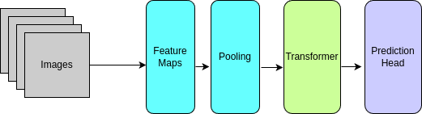

# RSNA 2024 Lumbar Spine Degenerative Classification - 24th place

Thanks to the organizers for this competition, and my partner Simon Veitner for the help!

## Overview

[Competition Main Page](https://www.kaggle.com/competitions/rsna-2024-lumbar-spine-degenerative-classification/overview)

[Competition Data Page](https://www.kaggle.com/competitions/rsna-2024-lumbar-spine-degenerative-classification/data)

Our solution was built from a two stage process:

1. Find the key points
    1. Use a TD-CNN to determine the instance numbers.
    2. Use a UNet Segmentation model and heatmap loss to determine the locations of each of the vertebrae.
2. Crop and classify each condition.
    1. Resize to constant pixel size and area.
    2. Use a TD-CNN to do the classification.


The code is available at [https://github.com/phalendj/rsna2024](https://github.com/phalendj/rsna2024).


## Comments on the Data

Looking through the training data, we had the different studies, which were then divided into different series covering the different image types Sagittal T2/STIR, Sagittal T1, and Axial T2.  In some studies there were multiple series of a single image type.  Within the different image types, there were what I called 'Stacks', which were instances that formed a regular grid of voxels, so all had the same orientation and spacing.

Within a single stack, we can come up with the affine matrix that maps the voxel location to a point in the world space via an Affine matrix that can be constructed from the image orientation and location data in the dicom metadata.  We then would use this affine matrix for each stack to translate points from one pixel space into another.  To construct the full affine matrix, we followed (https://nipy.org/nibabel/dicom/dicom_orientation.html)[https://nipy.org/nibabel/dicom/dicom_orientation.html].  Let $$(Z_x \Delta k, Z_y \Delta k, Z_z \Delta k) = S_1 - S_0$$ be the difference in the zero voxel points of two instances, then the affine matrix is defined $P = A n$

$$ \left\[\begin{array}{c}
P_x \\\\
P_y \\\\
P_z \\\\
1 \end{array}
\right\] = 
\left\[
\begin{array}{cccc}
X_x \Delta i & Y_x \Delta j & Z_x \Delta k & S_x \\\\
X_y \Delta i & Y_y \Delta j & Z_y \Delta k & S_y \\\\
X_z \Delta i & Y_z \Delta j & Z_z \Delta k & S_z \\\\
0 & 0 & 0 & 1 \\\\
\end{array}
\right\]
\left\[\begin{array}{c}
i \\\\
j \\\\
k \\\\
1 \end{array}
\right\]
$$

And conversions from one pixel space to another are done using the matrix $$ A^{\prime -1} A$$.

Many of the vertebrae we found to be mislabelled, usually off by one.  We went through a few iterations of finding where our model for keypoints did not match the training data and corrected any training data.

## Model

### Finding diagnosis location points

#### Instance finding

For this we focussed on the Sagittal T2/STIR images in order to find the locations of the vertebrae.  First we found the projected instance numbers using a TD-CNN on all of the Sagittal T2/STIR instances of the largest stack,



We then output the probability that each image was the correct image.

#### Keypoint finding

Using the same Sagittal T2/STIR images, we used a 2.5D CNN with 15 channel input and timm_efficientnet_b2 in the segmentation-models-pytorch package.  We then used Heatmap loss as outlined in [https://www.kaggle.com/code/sacuscreed/sagittal-t2-sagittal-level-segmentation](https://www.kaggle.com/code/sacuscreed/sagittal-t2-sagittal-level-segmentation) by Angel Jacinto Sanchez Ruiz (@sacuscreed).


Finally, after taking the training data and translating each label coordinate to the world space, we found the average offset in mm for the foraminal locations and the subarticular locations.   We used this to generate a file 'test_label_coordinates.csv' for the next step.

Given the size of the areas we would pull for our diagnosis model, we found that this was good enough to move to the next level.

### Diagnosis Model

After finding locations, we used a 224x224 image for input into a TDCNN, same as outlined above.  We would find the center location for a level, then cut an image of size 40-50mm around that location and scale to the input size.  We found that the different studies had a wide variety of pixel spacings, so this gave a standard size of the target area.  We would then train this with Weighted CrossEntropyLoss.  The model we submitted with was `densenet121`.

For spinal, the size of a batch for training would be (B, 5(Levels), 11(Images), 224, 224), for foraminal narrowing (B, 5(Levels), 2 (Sides), 11(Images), 224, 224), and for subarticular stenosis (B, 5(Levels), 7(Images), 224, 224).  For Subarticular Stenosis, we found applying a flip to the right side images gave a better model since everything was in a standard format.

After all of the training, we did add a master model that had all the same inputs, but joined all outputs for a single level into a large input for a classifier head.  We found there was a lot of correllation in the different diagnoses for a single spinal level, but not as much among the different levels.

### What did not work for us


1. 3D models
2. Using all images in a single TD-CNN.


### Things we would have done better

1. After the initial finding of key points on Sagittal T2/STIR, I would have probably been better off if we had used that to better zoom in on the locations in the other views.
2. Many more models in the ensemble.  


## Running

We used Poetry to manage all packages.

## Setup Poetry for package management
```
curl -sSL https://install.python-poetry.org | python -
```

## To Run
```
poetry run python rsna2024/run.py --config-name=<config name>.yaml 
```

To train our models, we used the following config files, found in the `config` directory.

1. For instance prediction: tdcnn_instance_labels.yaml
2. For instance prediction: unet_segment_spinal.yaml
3. For Spinal Canal Stenosis prediction: tdcnn_level_sagittalt2.yaml
4. For Neural Foraminal Narrowing prediction: tdcnn_level_sagittalt1.yaml
5. For Subarticular Stenosis prediction: tdcnn_level_axialt2.yaml

